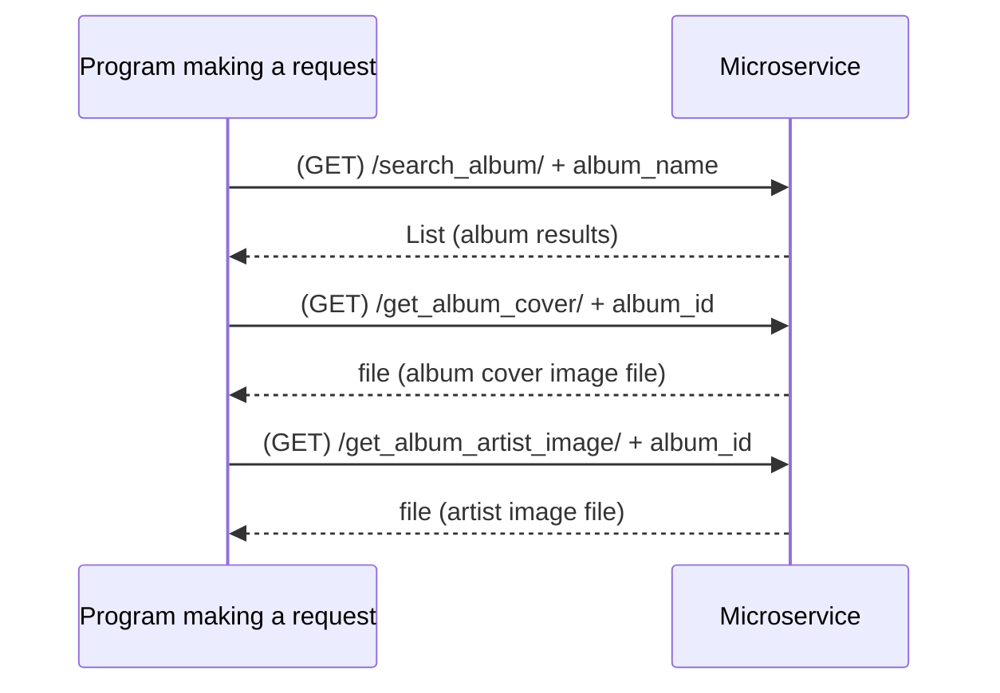

# alternative album cover
This repo is a server to offer a service to
- Search spotify album info based on a album name.
- Get the album cover based on a spotify album id.
- Get the photo of the artist of a album based on the album's id.

## Pre-requisites
- Get your spotify api client id and secret by checking [here](https://developer.spotify.com/documentation/web-api/concepts/apps). Then put it in the `internal_spotify_api.py` file.
- Install flask by running `pip install flask`.

## How to programmatically REQUEST and RECEIVE data
- search_album
  - Send a GET request to `http://127.0.0.1:5000/search_album/ + album_name`
  - Sample response:
    ```json
    [
        {
            "album_artist": [
                {
                    "external_urls": {
                        "spotify": "https://open.spotify.com/artist/3jr9qsKWQjf3iMNQ3rWVDQ"
                    },
                    "href": "https://api.spotify.com/v1/artists/3jr9qsKWQjf3iMNQ3rWVDQ",
                    "id": "3jr9qsKWQjf3iMNQ3rWVDQ",
                    "name": "To The Grave",
                    "type": "artist",
                    "uri": "spotify:artist:3jr9qsKWQjf3iMNQ3rWVDQ"
                }
            ],
            "album_id": "4AKiiQWquHcV1G4tJRxWXa",
            "album_name": "Global Warning"
        },
        {
            "album_artist": [
                {
                    "external_urls": {
                        "spotify": "https://open.spotify.com/artist/0TnOYISbd1XYRBk9myaseg"
                    },
                    "href": "https://api.spotify.com/v1/artists/0TnOYISbd1XYRBk9myaseg",
                    "id": "0TnOYISbd1XYRBk9myaseg",
                    "name": "Pitbull",
                    "type": "artist",
                    "uri": "spotify:artist:0TnOYISbd1XYRBk9myaseg"
                }
            ],
            "album_id": "2F7tejLHzTqFq2XLol9ZGy",
            "album_name": "Global Warming: Meltdown (Deluxe Version)"
        }
    ]
    ```
- get album cover
  - Send a GET request to `http://127.0.0.1:5000/get_album_cover/ + album_id`
    - Sample response is a image file.
- get artist photo of album
  - Send a GET request to `http://127.0.0.1:5000/get_artist_photo/ + album_id`
    - Sample response is a image file.

Check the `test.py` file to see how to use the service for more details.

## UML Sequence Diagram
